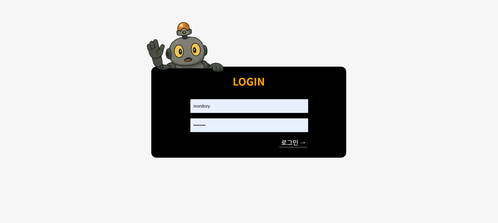
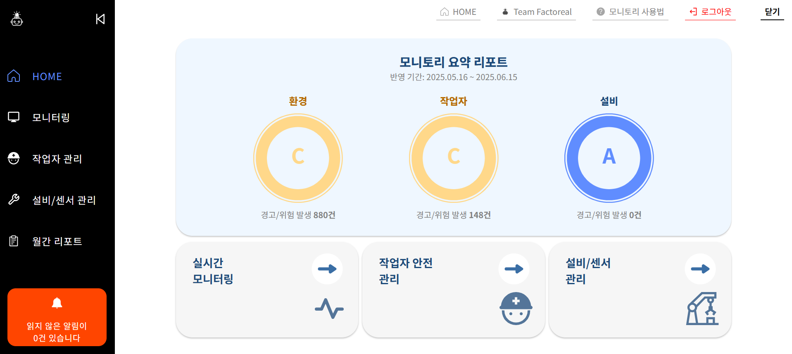
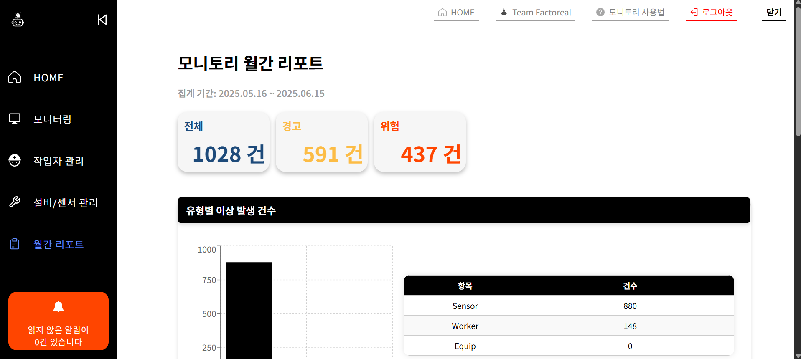

# Monitory FE

공장 통합 모니터링 시스템 **Monitory**의 프론트엔드(React) 프로젝트입니다.

---

## 🏭 프로젝트 소개

**Monitory**는 공장 내 다양한 설비, 환경, 작업자 정보를 실시간으로 통합 모니터링하고  
이상 상황을 빠르게 감지·알림·분석하는 웹 서비스입니다.

- **실시간 모니터링**: 센서/설비/작업자 상태를 대시보드로 한눈에 확인
- **이상 감지 및 알림**: 위험/경고 상황 발생 시 즉시 알림 제공
- **월간 리포트**: 공간/유형/날짜별 이상 발생 통계 제공
- **설비/작업자 관리**: 공간별 설비 및 작업자 등록·수정·삭제
- **웹소켓 기반 실시간 데이터 반영**

---

## 📁 폴더 구조

```
src/
  ├── App.jsx                # 라우팅 및 전체 레이아웃
  ├── Header.jsx             # 상단 헤더
  ├── Sidebar.jsx            # 사이드바 메뉴
  ├── main.jsx               # 진입점
  ├── api/                   # API 통신 모듈 (axiosInstance 정의)
  ├── assets/                # 이미지, 아이콘, SVG 등 정적 자산
  ├── components/            # 재사용 가능한 컴포넌트
  ├── contexts/              # 전역 상태/컨텍스트 (알림 기능 전용)
  ├── hooks/                 # 커스텀 훅 (알림 기능 전용)
  ├── pages/                 # 주요 페이지 컴포넌트
  ├── styles/                # CSS 파일
  ├── types/                 # 타입 정의 (알림 기능 전용)
  ├── websocket/             # 웹소켓 관련 훅
```

---

## 🚀 주요 기능

### 1. 실시간 모니터링

- **공간별 센서/설비/작업자 상태**를 실시간으로 확인
- **웹소켓(STOMP/SockJS)** 기반 실시간 데이터 반영

### 2. 알림 및 이상 감지

- 위험/경고 상황 발생 시 **알림 모달** 및 **우측 하단 알림**
- 읽지 않은 알림 개수 실시간 표시

### 3. 월간 리포트

- **공간/유형/날짜별** 이상 발생 건수 시각화
- **그래프** 및 **요약 통계** 제공

### 4. 설비/작업자 관리

- 설비/작업자 **등록, 수정, 삭제**
- 공간별 설비/작업자 할당

### 5. 사용자 인증

- **세션 기반 로그인/로그아웃**
- 로그인 상태에서만 주요 기능 접근 가능

---

## 🛠️ 기술 스택

- **React 18+**
- **React Router v6**
- **Axios** (API 통신)
- **SockJS, @stomp/stompjs** (웹소켓)
- **Vite** (개발 서버/빌드)
- **CSS Modules & Custom CSS**
- **Jest/React Testing Library** (테스트)

---

## ⚡️ 빠른 시작

### 1. 설치

```bash
git clone https://github.com/Fac2Real/monitory-fe.git
cd monitory-fe
npm install
```

### 2. 환경 변수 설정

`.env` 파일을 프로젝트 루트에 생성하고 아래와 같이 작성하세요.

```
VITE_BACKEND_URL=http://localhost:8080
```

### 3. 개발 서버 실행

```bash
npm run dev
```

### 4. 빌드

```bash
npm run build
```

---

## 🖥️ 주요 화면

- **로그인 페이지**  
  

- **메인 대시보드**  
  

- **월간 리포트**  
  

---

## 📡 웹소켓 구조

- `/src/websocket/useWebSocket.js`  
  - `useWebSocket`, `useWebSocket2`, `useWebSocket3` 등 커스텀 훅 제공
  - 로그인 상태(`localStorage.isLoggedIn`)에 따라 연결/해제
  - 실시간 알림, 센서 데이터, 알림 개수 3개 채널 구독

---

## 🧩 주요 컴포넌트

- **Sidebar**: 메뉴 및 알림, 로그아웃 등
- **Header**: 상단 네비게이션
- **MainBox**: 대시보드 요약
- **ZoneInfoBox**: 공간별 상세 정보
- **RegisterWorker**: 작업자 등록/수정
- **Modal**: 다양한 모달 컴포넌트 (알림, 편집, 등록 등)
- **LogTable**: 시스템 로그

---

## 📝 코드 스타일 & 컨벤션

- 함수형 컴포넌트 + React Hooks 사용
- 스타일은 CSS 사용 권장 
- API 통신은 `/src/api/axiosInstance.js`에서 관리
- 상태 관리는 주로 useState/useEffect, 필요시 Context 사용

---

## 🛡️ 보안 및 인증

- **세션 기반 인증(JSESSIONID, HttpOnly)**
- 로그인 성공 시 `localStorage.isLoggedIn` 플래그로 UI 제어
- 실제 인증은 항상 서버에서 검증

---

## 🙋‍♂️ 기여 방법

1. 이슈 등록 및 브랜치 생성
2. PR 작성 시 상세 설명 필수
3. 코드 리뷰 후 병합

---

## 👨‍💻 팀 정보

- [팀 소개 및 멤버 정보](./src/assets/data/teamData.js)

---

## 💬 문의

- 이슈 또는 PR로 문의해 주세요.
- FE 담당자 이메일: [cactusgreen@naver.com](mailto:cactusgreen@naver.com)

---
